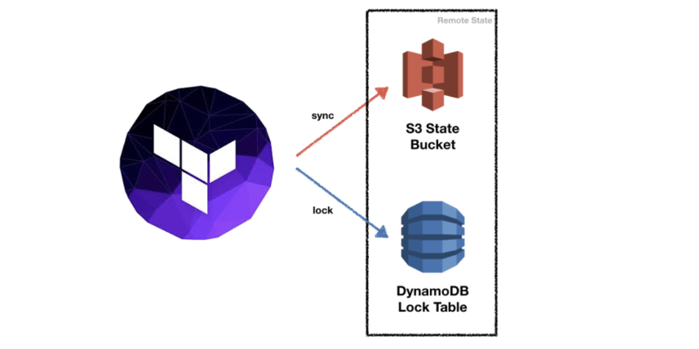

<!-- _paginate: false -->
<!-- _class: lead -->

# <!-- fit --> Terraform with AWS

### Hosted by Marcus Ross for CGI

**Version:** 1.0.3

---

# Course Details

We have two sessions (days) to cover the agenda.

- Session 1 @ 9AM-4PM Terraform Fundamentals and AWS Core Services
- Session 2 @ 9AM-4PM Terraform Advanded and more AWS Services

---

# Goals of the Course

- use Terrafrom to deploy some Infrastructure
- Hands-On Time
- getting a refresh on AWS services

---

# Manual Configuration Challenges

- Creating and configuring services is often done manually
- Documentation
- Reliability
- Reproducibility
  - Dev
  - Test
  - Prod

---

# What is Infrastructure as Code?

> “Infrastructure as Code is the process of managing and provisioning computer data centers through machine-readable definition files, rather than physical hardware configuration or interactive configuration tools”

Source: [Wikipedia](https://en.wikipedia.org/wiki/Infrastructure_as_code)

---

# Is Terraform the only how does IaC?


---

# Terraform – Template Example

This template creates a single EC2 instance in AWS


---

# Terraform – Core Loop


---

# Terraform – Key capabilities

- Terraform is a tool for provisioning infrastructure

- supports many providers (cloud agnostic)

- many resources for each provider

- define resources as code in terraform templates

---


---

# Terraform 1.0 - What are the beneifts?

- Extended Maintenance Periods
  (1.x releases have 18 month maintenance period)

- More mature and stable
  (essentially a 0.15 super-service pack)

- Terraform state is cross-compatible between versions
  (0.14.x, 0.15.x, and 1.0.x.)

---

# LAB

## Setup & "Hello Infra"

- Install and Setup Terraform
- create IAM User in AWS
  (AWS-CLI/Console)
- Initialize the aws-Provider
- define EC2-Instance and apply


---

# create a very risky simple ec2-instance (main.tf)

```json
provider "aws" {
  region = "us-west-2"
}

resource "aws_instance" "app_server" {
  ami = "ami-830c94e3"
  instance_type = "t2.micro"

  tags = {
    Name = "ExampleAppServerInstance"
  }
}
```

Why is this a weak example in the sense of IaC and **not** AWS perspective?

---

# Terraform Version constraints

specify a range of acceptable versions (">= 1.2.0, < 2.0.0")


---

### a better approach for a simple ec2-instance (main.tf)

```json
terraform {
  required_providers {
    aws = {
      source = "hashicorp/aws"
      version = "~> 3.27"
    }
  }
  required_version = ">= 1.0"
}

provider "aws" {
  region = "us-west-2"
}

resource "aws_instance" "app_server" {
  ami = "ami-830c94e3"
  instance_type = "t2.micro"

  tags = {
    Name = "ExampleAppServerInstance"
  }
}
```

---

# Working with a state file

- Terraform saves everything about the instance to special file(s)
- Same directory as template file with `.tfstate` extension
  - terraform.tfstate
  - terraform.tfstate.backup
- The statefile should **not** be **committed** into version control
- This can be a problem on multi-developer env´s (more about that tomorrow)

---

# Create a .gitignore for state-files

```text
# Local .terraform directories
**/.terraform/*

# .tfstate files
*.tfstate
*.tfstate.*

# Crash log files
crash.log

# Exclude all .tfvars files, which are likely to contain sentitive data
*.tfvars
```

##### Source: [GitHub](https://github.com/github/gitignore/blob/main/Terraform.gitignore)

---

# LAB

## manage drift with Terraform

- check `terraform.tfstate`
- change Instance-Type to `t3.micro`
- add a `costcenter=42` Tag
- `$ terraform apply` changes
- check the statefile again
- change costcenter via Dashboard
- `terraform plan` and check if TF can manage this drift


---

# Terraform _Standard_ Filelayout

| File / Folder | Purpose                          |
| ------------- | -------------------------------- |
| main.tf       | Terraform Config and Constraints |
| outputs.tf    | Output like IPs, Addresses, etc  |
| providers.tf  | Provider-Specific (Cred.)        |
| resources.tf  | for small projects               |
| variables.tf  | place for specifying variables   |
| README.md     | Documentation                    |
| env           | folder place for tfvar-files     |

---

# LAB

## please refactor your code

- add `provider.tf` and refactor
- add `ressource.tf` and refactor
- create empty file `variables.tf`
- create empty file `output.tf`
- create an `env` folder

## 

---

# getting replicas with count

This template creates 4 single EC2 instance in AWS

```json
resource "aws_instance" "app_server" {
  count         = 4
  ami           = "ami-830c94e3"
  instance_type = "t2.micro"

  tags = {
    Name = "App Server ${count.index+1}"
  }
}
```

---

# Welcome to the World of Variables

---

# Variables - simple types

There are simple types of variables you can set:

- string
- number
- bool

### define a Variable (variables.tf)

```json
variable "app_server_instance_type" {
  type        = string
  default     = "t2.micro"
  description = "The aws instance-type"
}
```

---

### use Variables in HCL (main.tf)

```json
resource "aws_instance" "app_server" {
  count         = var.app_server_count
  ami           = var.ami_id
  instance_type = var.app_server_instance_type

  tags = {
    Name = "App Server ${count.index+1}"
  }
}
```

---

# Custom validation with Rules I (variables.tf)

using a validation block nested within the variable block

```json
variable "image-id" {
  type        = string
  description = "The id of the machine image (AMI) to use for the server."

  validation {
    condition     = length(var.image_id) > 4 && substr(var.image_id, 0, 4) == "ami-"
    error_message = "Image-id value must be a valid ami id, does it start with 'ami-'?"
  }
}
```

---

# Custom validation with Rules II (variables.tf)

you can even use regex for this

```json
variable "image-id" {
  type        = string
  description = "The id of the machine image (AMI) to use for the server."

  validation {
    # regex(...) fails if it cannot find a match
    condition     = can(regex("^ami-", var.image_id))
    error_message = "Image-id value must be a valid ami id, does it start with 'ami-'?"
  }
}
```

---

# LAB

## use Variables & Functions I

- create variable `node_count`
- create variable `ami_id`
- create varible `instance_type`
- create 3 replicas of your EC2


---

# Variables - Type Map

A Map is a lookup table, where you specify multiple keys with different values

```json
# define a map of images
variable "images" {
  type = "map"

  default = {
    eu-central-1 = "image-1234"
    us-west-1    = "image-4567"
  }
}

# getting the value for region eu-central-1
image_id = var.images["eu-central-1"]

# getting the correct value via a lookup
image_id = lookup(var.images, var.region)
```

---

# Variables - Type List

A list value is an ordered sequence of strings indexed by integers starting with zero.

```json
# define a map of images
variable "user_names" {
  type = "list(String)"
  default = ["Admin", "Jane", "Dane"]
}

# getting the value for the first entry
user = var.user_names[0]

# loop through in a ressource
count = length(var.user_names)
user  = var.user_names[count.index]
```

---

# LAB

## use Variables & Functions II

- create variable `region` and set default to **eu-central-1**
- change variable type `ami_id` to `map`


---

# Setting Values with tfvars-Files

place Terraform variables in a special file (`*.tfvars`) and load them with the Terraform command:

```
foo = "bar"

somelist = ["one","two"]

somemap = {
  foo = "bar"
  bax = "qux"
}
```

Linux: `$ terraform apply -var-file=env/development.tfvars`
Windows: `$ terraform apply --var-file=env/development.tfvars`

---

# LAB

## use Variable-Files

- create `production.tfvar`
  - `region` to 'eu-central-1'
  - `instance_type` to t3.micro
  - `node_count` to 2
- create `development.tfvar`
  - `region` to 'eu-west-1'
  - `instance_type` to t2.micro
  - `node_count` to 1


---

# use of environment variables

you can also supply values to your variables by using environment variables
Terraform will automatically read all environment variables with the `TF_VAR_` prefix

##### Example variable.tf

```
variable db_password {
  type = string
}
```

set the value (Linux)
`export TF_VAR_db_password=Secret123`

set the value (PowerShell)
`$env:TF_VAR_db_password=Secret123`

---

# use Variables on the Command Line

To specify individual variables on the command line, use the `-var` option when running the terraform plan and terraform apply commands:

```bash
$ terraform apply -var="db_engine"="mysql"

$ terraform apply -var='user_names_list=["Peter","Paul","Marry"]

$ terraform apply -var='image_id_map={"us-east-1":"ami-abc123","us-east-2":"ami-def456"}
```

---

# Variable Definition Precedence

Terraform loads variables in the following order (later sources taking precedence over earlier ones):

1. Environment variables
1. The terraform.tfvars file, if present.
1. The terraform.tfvars.json file, if present.
1. Any _.auto.tfvars or _.auto.tfvars.json files, processed in lexical order of their filenames.
1. Any -var and -var-file options on the command line, in the order they are provided. (This includes variables set by a Terraform Cloud workspace.)

---

# Conditional Expressions

A conditional expression uses the value of a bool expression to select one of two values.

The syntax of a conditional expression is as follows:
`condition ? true_val : false_val`

Example with a region-default value if not set:
`var.region != "" ? var.region : "eu-central-1"`

---

# LAB

## use conditionals

- create a variable
  `var.server_build`
- create a conditional-expression if server should be build


---

# Declaring an Output Value

Each output block that will be declared is exported after each `apply`:

What is the difference and when we use a) or b):

a)

```json
output "app_server_ip_addr" {
  value = aws_instance.app_server.*.public_ip
}
```

b)

```json
output "app_server_ip_addr" {
  value = aws_instance.app_server.public_ip
}
```

---

# terraform output on the commandline

You can use `terraform output` to get the latest info **from** the **state-file**

Output everything variable:

```bash
$ terraform output
app_server_public_ip = [
  "18.192.194.218",
]
```

output as JSON Object with [jq](https://stedolan.github.io/jq/)-parsing

```bash
$ terraform output -json app_server_public_ip | jq -r '.[0]'
```

---

# Sensitive Variables

Setting a variable as `sensitive` prevents Terraform from showing its value in the plan or apply output.

Terraform will still record sensitive values in the **statefile**, and so anyone who can access the state data will have access to the sensitive values in cleartext.

```json
variable admin_password {
  type      = string
  sensitive = true
}
```

use Tools like:
[Vault](https://learn.hashicorp.com/tutorials/terraform/secrets-vault?in=terraform/secrets) / [AWS Secrets Mgmt.](https://aws.amazon.com/secrets-manager/pricing/) / [Mozilla SOPS](https://github.com/mozilla/sops)

---

# more functions and dynamic blocks

---

# using a more then one Tag for each Instance

```json
variable "common_tags" {
  type = map(string)
  default = {
    Department  = "Global Infrastructure Services",
    Team        = "EMEA Delivery",
    CostCenter  = "12345",
    Application = "Intranet-Portal"
  }
}
```

---

# use of a map with common tags

#### use it just as a variable:

```json
resource "aws_instance" "app_server" {
  ...omitted output...
  tags = var.common_tags
  ...omitted output...
}
```

#### use it with the merge()-function

```json
  tags = merge(var.default_tags, {
    Name = "AppSrv-${count.index + 1}"
    },
  )
```

---

# LAB

## use some common_tags

- create a map-variable
  `var.common_tags`
- set the tags:
  CostCenter = "12345"
  DeployedBy = "Terraform"
  SLA = "High"


---

# Install a Webserver

Usually we can use SSH Access to install software manually or use something like Ansible. Here we will use the clout-init-hook `user_data` from an EC2-Ressource.

```
user_data = << EOF
  #!/bin/bash
  sudo apt-get update
  sudo apt-get install -y apache2
  sudo systemctl start apache2
  sudo systemctl enable apache2
  echo "<h1>Deployed via Terraform</h1>" > /var/www/html/index.html
EOF
```

---

# file()-Function

we can use the file-function to dynamically load **local** files during deployment:

##### Example install_webserver.sh

```bash
#!/bin/bash
yum install httpd -y
/sbin/chkconfig --levels 235 httpd on
service httpd start
instanceId=$(curl http://169.254.169.254/latest/meta-data/instance-id)
region=$(curl http://169.254.169.254/latest/meta-data/placement/region)
echo "<h1>$instanceId from $region</h1>" > /var/www/html/index.html
```

##### Example main.tf in ressource ec2-instance

```json
user_data = "${file("install_webserver.sh")}"
```

---

# LAB

## install a webserver at startup

- create an install script for Apache
- add a user-data section to ec2
- use file-function to load the script
- check the webserver on the host `curl localhost`


---

# Create Security Groups- and Rule-Objects

```json
resource "aws_security_group" "web_access" {
  name        = "web_access"
  description = "Allow port 80 access from outside world"
}

resource "aws_security_group_rule" "allow_webserver_access" {
  type              = "ingress"
  from_port         = 80
  to_port           = 80
  protocol          = "tcp"
  cidr_blocks       = ["0.0.0.0/0"]
  security_group_id = aws_security_group.webdata.id
}
```

---

### Use Security Groups as one ressource with blocks

```json
resource "aws_security_group" "ssh_access" {
  name        = "web_security_group"
  description = "Terraform web security group"
  vpc_id      = "vpc-47111266642"

  egress {
    from_port   = 0
    to_port     = 0
    protocol    = "-1"
    cidr_blocks = ["0.0.0.0/0"]
  }

  ingress {
    from_port   = 22
    to_port     = 22
    protocol    = "tcp"
    cidr_blocks = ["0.0.0.0/0"]
  }
}
```

---

# LAB

## security a.k.a. SG

- create a security-group "webserver-access"
- add ingress-rule for port 22 and port 80 open to the world
- add egress-rule for everything open to the world (if necessary)


---

# dynamic Blocks in Terraform

Within top-level block constructs like resources, expressions can usually be used only when assigning a value to an argument using the `name = expression` form. This covers many uses, but some resource types include repeatable
**nested blocks** in their arguments, which typically represent separate objects that are related to (or embedded within) the containing object:

---

### Create Security Groups with dynamic blocks (simple)

```json
locals {
  ports = [80, 443, 22]
}

resource "aws_security_group" "dynamic-demo" {
  name        = "demo-sg-dynamic"
  description = "Dynamic Blocks for Ingress"

  dynamic "ingress" {
    for_each = local.ports
    content {
      description = "description ${ingress.key}"
      from_port   = ingress.value
      to_port     = ingress.value
      protocol    = "tcp"
      cidr_blocks = ["0.0.0.0/0"]
    }
  }
}
```

---

### Create Security Groups with dynamic blocks (with maps)

```json
locals {
  map = {
    "description 0" = {
      port = 80,
      cidr_blocks = ["0.0.0.0/0"],
    }
    "description 1" = {
      port = 22,
      cidr_blocks = ["10.0.0.0/16"],
    }
  }
}
resource "aws_security_group" "map" {
  name        = "demo-map"
  description = "demo-map"

  dynamic "ingress" {
    for_each = local.map
    content {
      description = ingress.key # IE: "description 0"
      from_port   = ingress.value.port
      to_port     = ingress.value.port
      protocol    = "tcp"
      cidr_blocks = ingress.value.cidr_blocks
    }
  }
}
```

---

# LAB

## using dynamic blocks:

- refactor the security-group "webserver-access" to use dynamic blocks
- add the following ingress-rules

  | Port | CIDR-Block        | Description    |
  | ---- | ----------------- | -------------- |
  | 22   | only within VPC   | ssh access     |
  | 80   | open to the world | web access     |
  | 443  | open to the world | tls web access |

---

# Datasources

Data sources allow Terraform use information defined outside of Terraform.

Examples: VPC-ID, AMI-ID, KeyPair, Hosted Zone Info, Textfiles, etc.

This is defined by another separate Terraform configuration, or modified by functions. Each provider may offer data sources alongside its set of resource types.

---

# Datasource aws_ami

Use this data source to get the ID of a registered AMI for use in other resources.

```json
data "aws_ami" "amazon-linux-2" {
  owners      = ["amazon"]
  most_recent = true

  filter {
    name   = "name"
    values = ["amzn2-ami-hvm-*-x86_64-ebs"]
  }
}
```

---

# Datasource aws_vpc

`aws_vpc` provides details about a specific VPC.

This resource can prove useful when a module accepts a vpc id as an input variable and needs to, for example, determine the CIDR block of that VPC.

```json
data "aws_vpc" "selected" {
  tags = {
    Owner = "Terraform",
    Name  = "terraform-example-vpc"
  }
}
```

---

# Datasource aws_subnets_ids

`aws_subnet_ids` provides a set of ids for a vpc_id
This resource can be useful for getting back a set of subnet ids for a vpc.

```json
data "aws_subnet_ids" "selected" {
  vpc_id = data.aws_vpc.selected.id
}
```

The following example retrieves a set of all subnets in a VPC with a custom tag of Tier set to a value of "Private".

```json
data "aws_subnet_ids" "private" {
  vpc_id = var.vpc_id
  tags = {
    Tier = "Private"
  }
}
```

---

# LAB

## use a datasource

- create a datasource to query the newest Amazon Linux 2 AMI
- create an ec2-instance and use the AMI dynamically


---

# Datasource **template_file** 1/2

The template_file data source renders a template from a template string, which is usually loaded from an external file.

```json
data "template_file" "userdata" {
  template = file("${path.module}/userdata.sh")
  vars = {
    DOCKER_VERSION  = var.DOCKER_VERSION
    ANSIBLE_VERSION = var.ANSIBLE_VERSION
  }
}
```

---

# Datasource **template_file** 2/2

File userdata.sh

```bash
#!/bin/bash -xe
yum update -y

amazon-linux-extras install docker=${DOCKER_VERSION}  -y
amazon-linux-extras install ansible2=${ANSIBLE_VERSION} -y
yum install -y zip unzip
```

use the datasource in ec2.tf

```json
resource "aws_instance" "webserver" {
  user_data  = data.template_file.userdata.rendered
  ...
}
```

---

# Dependencies and Terraform

---

# Understand Dependency Graphs

Terraform doesn't simply build resources and write configuration into a state file
Internally, it also manages a dependency graph of all the resources
For dependencies, a directed graph is necessary


---

# Dependency Graphs in Terraform

- Terraform uses dependency graphs to determine the build and deletion order of resources
- Three different types of nodes in a Terraform graph:
  - Resource node
  - Provider configuration node
  - Resource meta-node

---

# Controlling dependencies with depends_on

- Usually, Terraform will resolve dependencies automatically
- Sometimes built-in dependency resolution leads to to unwanted behavior
- Enforce dependencies: `depends_on`
  - Accepts a list of resources that this resource depends on
  - Resource won't be created until the ones listed inside this parameter are created

```
resource "aws_instance" "app_server" {
  ami             = var.ami_id
  instance_type   = var.instance_type

  depends_on = [
    aws_instance.db_server
  ]
}
```

---

# Terraform Graph Visualization

- Dot-Files are Text-Based
- Use [Graphviz](https://graphviz.org/) to visualize
- Possible output
  - Several pixel images
  - SVG
  - PDF
  - Postscript


---

# No dependency graph representation

`$ terraform graph | dot -Tpng > no-dep-graph.png`


---

# Dependency graph representation

`$ terraform graph | dot -Tpng > dep-graph.png`


---

# LAB

## dependencie visualization

- create a second ec2 ressource in terraform
- create a graph `no-dep.png`
- change the second ec2 ressource with `depends_on`
- create a graph `dep.png`


---

# S3 Storage and Terraform

---

# S3 Bucket-Ressource

```json
resource "aws_s3_bucket" "bucket" {
  bucket = var.s3bucket_name
  acl    = "private" # Default-Value

  versioning {
    enabled = true
  }
}
```

---

# S3 Bucket Upload

```json
resource "aws_s3_bucket_object" "video_upload_object" {
  bucket = var.s3bucket_name
  key    = "video.mp4"
  source = "video.mp4"

  # The filemd5() function is available in Terraform 0.11.12 and later
  # For Terraform 0.11.11 and earlier, use the md5() function and the file() function:
  # etag = "${md5(file("path/to/file"))}"
  etag = filemd5("video.mp4")

  depends_on = [
    aws_s3_bucket.bucket
  ]
}
```

---

# LAB

## S3 essentials

- create a unique-bucket
- upload a file to it


---

# use S3 lifecycle

```json
resource "aws_s3_bucket" "bucket" {
  bucket = "terraform-20181219040316452900000001"
  acl = "private"

  lifecycle_rule {
    enabled = true
    transition {
      days = 30
      storage_class = "STANDARD_IA"
    }
    transition {
      days = 60
      storage_class = "GLACIER"
    }
  }
}
```

after 30 days move the objects to `STANDARD_IA` and after 60 days to `GLACIER`.

---

# S3 Hosting a Website

```json
resource "aws_s3_bucket" "static_bucket" {
  bucket = var.static_bucket_name
  acl    = "public-read"

  website {
    index_document = "index.html"
    error_document = "error.html"
  }
}
```

---

# Create a Policy with Placeholders

```json
{
  "Version": "2012-10-17",
  "Statement": [
    {
      "Sid": "Allow Public Access to All Objects",
      "Effect": "Allow",
      "Principal": "*",
      "Action": "s3:GetObject",
      "Resource": "arn:aws:s3:::${bucket_name}/*"
    }
  ]
}
```

---

# S3 Create a Policy / using templatefile()

```json
resource "aws_s3_bucket_policy" "bucket_policy" {
  bucket = aws_s3_bucket.static_bucket.id

  policy = templatefile("bucket_policy.tpl", {
    bucket_name = var.static_bucket_name
  })
}
```

---

# Upload a website-Assets

```json
resource "aws_s3_bucket_object" "html_object" {
  bucket       = var.static_bucket_name
  key          = "index.html"
  source       = "index.html"
  content_type = "text/html"

  # The filemd5() function is available in Terraform 0.11.12 and later
  # For Terraform 0.11.11 and earlier, use the md5() function and the file() function:
  # etag = "${md5(file("path/to/file"))}"
  etag = filemd5("index.html")

  depends_on = [
    aws_s3_bucket_policy.bucket_policy,
    aws_s3_bucket.static_bucket
  ]

}
```

---

# LAB

## Hosting a website on S3

- create an unique-bucket
- create a bucket-policy
- upload an index.html
- try to access the html-page


---

# Use a random-Provider for **unique** Buckets

define the random-provider (provider.tf)

```json
provider "random" {
}
```

create a random-ressource (rand.tf)

```json
resource "random_id" "s3-random-id" {
  byte_length = 4
}
```

use the random-ressource with a bucket (s3.tf)

```json
resource "aws_s3_bucket" "bucket" {
  bucket = "${var.s3_bucket_name}-${random_id.s3-random-id.dec}"
}
```

---

# LAB

## refactor with random

- use the random-provider
- implement a random-bucket-name


---

# Remote State File

- Stores the state at a key in a bucket on S3
- Lock the State via Dynamo DB

## 

---

# Remote State Configuration with S3 & DynamoDB

```json
terraform {
  backend "s3" {
    bucket         = "s3-terraform-backend"
    key            = "frontend-app/terraform.tfstate"
    region         = "eu-central-1"
    encrypt        = true
    dynamodb_table = "terraform-state-lock-dynamo"
  }
}
```

To start the initialization/migration use:
`$ terraform init`

---

# bootstrap state-ressources (optional)

```json
resource "aws_s3_bucket" "s3-state" {
  bucket = "s3-terraform-backend"
  acl = "private"
}
```

```json
resource "aws_dynamodb_table" "dynamodb-terraform-state-lock" {
  name = "terraform-state-lock-dynamo"
  hash_key = "LockID"
  read_capacity = 20
  write_capacity = 20

  attribute {
    name = "LockID"
    type = "S"
  }
}
```

---


# AWS Virtual Privat Cloud

- A VPC is a virtual network dedicated to your AWS account
- Requires an IPv4 address space and optionally IPv6 address ranges
- Enables you to create specific CIDR ranges for your resources to occupy
- Provides strict access rules for inbound and outbound traffic.

---

# Multi-VPC per Account

### Best suited for:

- single team or single organizations, such as managed service providers
- limited teams, which makes it easier to maintain standards and manage access


---

# Components of a VPC

- VPC CIDR Block
- Subnet
- Gateways
- Route Table
- Network Access Control Lists
- Security Groups


###### [Source from Rackspace Blog](https://www.rackspace.com/blog/aws-201-understanding-the-default-virtual-private-cloud)

---

# LAB

## Setup your VPC (hard-way)

- create a VPC in eu-central-1
- create a public Subnet for one AZ
- create an Internet-GW
- create a Route Table


---

# use the power of modules

---

# LAB

## Setup your VPC (Module-Support)

- create a VPC in eu-central-1
- create 3 public Subnets for 3 AZ
- create an Internet-GW
- create a Route Table


---

# Terraform and Application Load Balancer

---

# possible HA-Solution

- EC2-Instance´s / EKS / ELB
- Webserver Installation
- AutoScaling Group
- Application Load Balancer

---

# Terraform and RDS

---

# MySQL RDS Example

```json
resource "aws_db_instance" "rds_mysql" {
  allocated_storage      = 20
  max_allocated_storage  = 100
  storage_type           = "gp2"
  engine                 = "mysql"
  engine_version         = "5.7"
  instance_class         = var.db_instance_type
  name                   = var.db_name
  username               = var.db_user
  password               = var.db_password
  parameter_group_name   = "default.mysql5.7"
  skip_final_snapshot    = true
  vpc_security_group_ids = [aws_security_group.mysql-access.id]
  publicly_accessible    = true
}
```

---

# LAB

## Setup a MySQQL RDS

- create a mysql database
- create a security-group
- create acess to public
- test the access via db-client (optional)


---

# Terraform an Route53

---

# use of the Route 53 Resource

```json
resource "aws_route53_record" "tf-alb-record" {
  zone_id = data.aws_route53_zone.zone.zone_id
  name    = "tf-alb.${var.route53_hosted_zone_name}"
  type    = "A"
  alias {
    name                   = aws_alb.alb.dns_name
    zone_id                = aws_alb.alb.zone_id
    evaluate_target_health = true
  }
}
```

---

# How to obtain hosted zone information

#### you can create a hosted zone (not usual)

```json
resource "aws_route53_zone" "my-test-zone" {
  name = "example.com"

  vpc {
    vpc_id = "${var.vpc_id}"
  }
}
```

#### you can use a datasource here to finde pre-deployed information

```json
data "aws_route53_zone" "zone" {
  name = "tf.itc.cgi-north.de"
}
```

---

# Isolating State Files

With a remote backend and locking, collaboration is no longer a problem. However, there is still one more problem remaining: **isolation**.

## Isolate State via workspaces!

`$ terraform workspace show`
`$ terraform workspace new prod`
`$ terraform workspace new qa`
`$ terraform workspace list`
`$ terraform workspace select prod`

---

# setup a simple example

```json
resource "aws_instance" "example" {
  ami = "ami-0c55b159cbfafe1f0"
  instance_type = "t2.micro"
}

terraform {
  backend "s3" {
    # Replace this with your bucket name!
    bucket         = "tf-demo-state-42"
    key            = "workspaces-example/terraform.tfstate"
    region         = "eu-central-1"

    # Replace this with your DynamoDB table name!
    dynamodb_table = "tf-demo-locks"
    encrypt        = true
  }
}
```

---

# LAB

## Setup workspaces

- create a simple ressource
- create a remote backend
- configure two different workspaces


---

# AWS Load Balancer

- Classic Load Balancer
- Application Load Balancer
- Network Load Balancer

---

# Classic-Loadbalancer Ressource (simple)

```json
resource "aws_elb" "elb-appserver" {
  name               = "elb-appserver"
  availability_zones = ["us-west-2a", "us-west-2b", "us-west-2c"]
  instances          = aws_instance.app_server.*.id
  security_groups    = [aws_security_group.elb-appserver-sg.id]

  listener {
    instance_port     = 80
    instance_protocol = "http"
    lb_port           = 80
    lb_protocol       = "http"
  }

  tags = {
    Name = "terraform-elb"
  }
}
```

---

# Application-Loadbalancer Ressource

```json
resource "aws_alb" "alb" {
  name            = "terraform-example-alb"
  security_groups = [aws_security_group.alb.id]
  subnets         = ["subnet-04c352b2400a7c891",
                     "subnet-0d752b61d8c0072d6",
                     "subnet-0b516a2ea3f89bdf4"]
}
```

```json
resource "aws_alb_listener" "listener_http" {
  load_balancer_arn = aws_alb.alb.arn
  port              = "80"
  protocol          = "HTTP"
  default_action {
    target_group_arn = aws_alb_target_group.web-group.arn
    type             = "forward"
  }
}
```

---

# Target-Group

```json
resource "aws_alb_target_group" "web-group" {
  name     = "terraform-example-alb-target"
  port     = 80
  protocol = "HTTP"
  vpc_id   = var.vpc_id
  health_check {
    path = "/"
    port = 80
  }
}
```

```json
resource "aws_lb_target_group_attachment" "alb-attachment" {
  count            = var.node_count
  target_group_arn = aws_alb_target_group.web-group.arn
  target_id        = aws_instance.webserver-instance[count.index].id
  port             = 80
}
```

---

# Auto Scaling Group

```json
resource "aws_autoscaling_group" "autoscaling_group" {
  launch_configuration = "${aws_launch_configuration.launch_config.id}"
  min_size             = "${var.autoscaling_group_min_size}"
  max_size = "${var.autoscaling_group_max_size}"
  target_group_arns    = ["${aws_alb_target_group.group.arn}"]
  vpc_zone_identifier = ["${aws_subnet.main.*.id}"]

  tag {
    key = "Name"
    value = "terraform-example-autoscaling-group"
    propagate_at_launch = true
  }
}
```

---

# LAB

## create an alb + webserver cluster

- create 2 webserver replicas with metadata-instace-id
- add ingress-rule for port 80 open to the world
- create an internet-facing alb with target-groups
- add a DNS-Entry for the ALB


---

# Thank you

---
